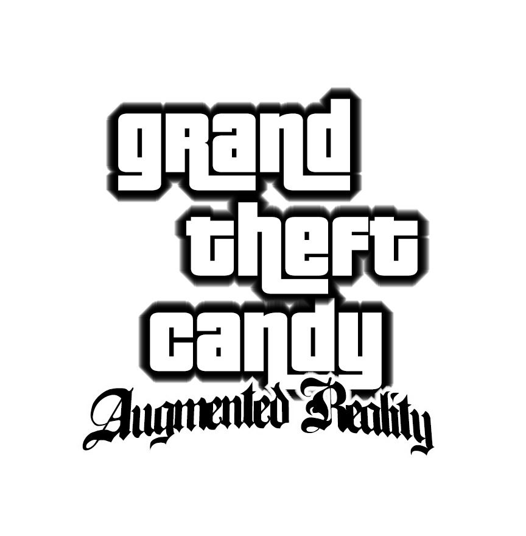

# Grand Theft Candy
Jump into the world of Grand Theft Candy. Collect candy and escape the police, can you make it to the highscore?

Items:
- Candy Cane: +2 Points
- Brokkoli: -10 Points
- Lightning: Speed Player up
- Snow Flake: Slows Player down
- Bomb: Collect and place the bomb whenever you want. A placed bomb detonates when the police is around.
- Star: Makes the player invincible for a few seconds and destroys police by contact
--> Destroyed Police Car: +10 Points

We implemented 4 different police movement patterns. These patterns vary with increasing score. The further you get, the harder the game will be. We integrated Firebase for the highscore funtionality.

## Disclaimer

This project was a group assignment at the LMU University of Munich. The purpose of this project is purely academic to see the iOS Augmented Reality Kit in action.

We do not own any of the sounds, 3D objects, animations or materials.
